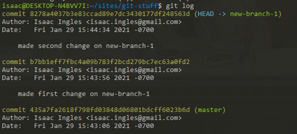

## Git rebase

### What is Git rebase?

Git rebase is a function that allows you to "re-base" the history of commits of one branch onto a seperate branch - effectively placing the history of commits of your current branch, in order, at the end of the second branch.

### What are some advantages and disadvantages of Git rebase?

Rebase allows you to combine the histories of two branches.  This might be useful if you were developing features on two different branches that turned out to be somewhat similar to each other - similar enough that they may as well be on the same branch.  It could also be useful if you want to test out how two branches will "work" with one another, without merging them.

The biggest disadvantage of Git rebase is that you "lose" history when you rebase one branch onto another.  This could make it more difficult to resolve/track down problems and conflicts.  It is a way of "changing" the history of the repository.  Changing the history also makes it more difficult to retrace the "actual" development workflow that you might have been following before. 

Knowing this, you shouldn't try to use rebase if you want to keep consistent track of your history and workflow.  For example, if you're working on a new feature, it would be easier to track the progress you've made on that feature as long as it keeps its own history, rather than rebasing it on another branch.

### Rebase

I've created a new repository on my hard drive, committed 1 change to master, created a new branch `new-branch-1`, and committed 2 changes to the new branch.  Here is my `git log`:

So my history looks like this:

Switching back to the master branch, I then type  `git rebase new-branch-1` .

So now my history looks like this:

What happened?  Looking again at Git log: 

I've essentially inserted the history of `new-branch-1` onto the end of the history of `master`  - so now `master` has a new commit with the two `new-branch-1` commits behind it.

### Interctive Rebase 

Back on `new-branch-1`, I've made a few more commits: 

So now our Git history looks like this:

After checking out `master` again, I try out 

## Git reset, checkout, and revert

## Git submodules