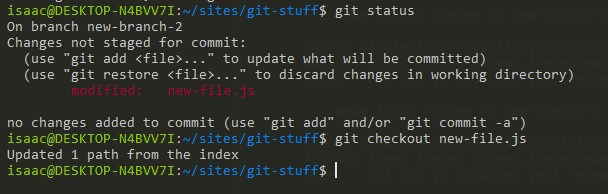

## Git rebase

### What is Git rebase?

Git rebase is a function that allows you to "re-base" the history of commits of one branch onto a seperate branch - effectively placing the history of commits of your current branch, in order, at the end of the second branch.

### What are some advantages and disadvantages of Git rebase?

Rebase allows you to combine the histories of two branches.  This might be useful if you were developing features on two different branches that turned out to be somewhat similar to each other - similar enough that they may as well be on the same branch.  It could also be useful if you want to test out how two branches will "work" with one another, without merging them.

The biggest disadvantage of Git rebase is that you "lose" history when you rebase one branch onto another.  This could make it more difficult to resolve/track down problems and conflicts.  It is a way of "changing" the history of the repository.  Changing the history also makes it more difficult to retrace the "actual" development workflow that you might have been following before. 

## When shouldn't you use Git rebase?

Knowing this, you shouldn't try to use rebase if you want to keep consistent track of your history and workflow.  For example, if you're working on a new feature, it would be easier to track the progress you've made on that feature as long as it keeps its own history, rather than rebasing it on another branch.

### Rebase merge

I've created a new repository on my hard drive, committed 1 change to master, created a new branch `new-branch-1`, and committed 2 changes to the new branch.  Here is my `git log`:

So my history looks like this:

Switching back to the master branch, I then type  `git rebase new-branch-1` .

So now my history looks like this:

What happened?  Looking again at Git log: 

I've essentially inserted the history of `new-branch-1` onto the end of the history of `master`  - so now `master` has a new commit with the two `new-branch-1` commits behind it.

### Interctive Rebase 

Back on `new-branch-1`, I've made a few more commits: 

So now our Git history looks like this:

After checking out `master` again, I try out `git rebase -i new-branch-1`, to see what an "interactive" rebase will do. 

Turns out it opens a text editor (in my case, nano) and gives you a list of commands.

According to the official [Git documentation](https://git-scm.com/book/en/v2/Git-Tools-Rewriting-History), 

>With the interactive rebase tool, you can then stop after each commit you want to modify and change the message, add files, or do whatever you wish. You can run rebase interactively by adding the -i option to git rebase. You must indicate how far back you want to rewrite commits by telling the command which commit to rebase onto.

Leaving the options blank and not selecting anything apparently just performs what looks like a "normal" rebase.

Again, from the [documentation](https://git-scm.com/book/en/v2/Git-Tools-Rewriting-History),

>The interactive rebase gives you a script that it’s going to run. It will start at the commit you specify on the command line (HEAD~3) and replay the changes introduced in each of these commits from top to bottom. It lists the oldest at the top, rather than the newest, because that’s the first one it will replay.

So, in order to pick out what commits you want to change, you need to specifically denote them when you run `git rebase -i`. 

When you type 

the "head~3" is the parent of the last commit that you want to edit; meaning you're actually going back 4 commits because the third one is the "parent".

Git opens the text editor and allows you to "pick" which commits to "edit":

### When shouldn't you rebase with a remote repo?

I did a bit of reading about this on the Internet, and from what I could find, you don't really want to mess with rebasing a remote repository at all.  Why?  Because Git treats a rebased repository history as a different history than the "original", and can cause all kinds of problems if you try to pull down the "new" history from the remote branch - the histories won't match, so you'll be left with a mess to untangle in the end.

## Git reset, checkout, and revert

### What is git reset?

According to the [documentation](https://git-scm.com/docs/git-reset), Git "manages and manipulates" three "trees":

|  Tree             | Role                               |       
|-------------------|------------------------------------|
| HEAD              | Last commit snapshot, next parent  |
| Index             | Proposed next commit snapshot      |
| Working Directory | Sandbox                  |

> git-reset - Reset current HEAD to the specified state

`HEAD` is a pointer to the current branch reference, `reset` moves what `HEAD` points to.

### Hard, Mixed, and Soft

All three reset modes reset HEAD to the given commit.  

`git reset --hard <commit>`  This discards all changes after the given commit and points your HEAD at the given commit.

`git reset --mixed <commit>` This preserves your files but changes are no longer "marked" for commit.  

`git reset --soft <commit>` This leaves all changed files alone, and simply points your HEAD at a given commit.

## Demonstration of a "soft" reset

Before using `git reset --soft` on my repository, the branch looks something like this:

Using `git log`,  I can see the hash of the previous commit, which I can specifically target (using only the first 7 characters of the hex value).  If I do a "soft" reset like so:

`HEAD` is now pointing to the targeted commit:

And my branch looks something like this: 

## Git checkout

`git checkout` allows you to change branches, work with an isolated commit, or work with individual files.

## Git revert

`git revert` is sort of self-explanatory - it allows you to "revert" commits.  In order to use `git revert`, your current working tree cannot have any changes.  

## Demonstration of checking out a commit

Taking a look at `git log` again, I chose a commit to checkout:

Which checked out the commit, but put my HEAD in this "detached" state:

So, what is a "detached HEAD" state?

As we know, "HEAD" is Git's way of referencing the current "place" in the repository.  When you
check out a branch, "HEAD" points to the last commit in that branch.  When you check out a solo commit, 
however, HEAD is "detached" from any branch, and is instead pointing only at that commit.

From this point, you can make any changes you like, and effectively create a "new" history of commits.  Because
you're detached from any branch, the changes that you make won't have any effect on your previous history.  If 
you just want to go back to a branch and discard any changes you've made, all you need to do is 
checkout another branch.  If you want to keep the changes, you can create a new branch, just like it says
in the instructions:

And from here we can continue to use branches and commits as we would "normally" do.

## Demonstration of checking out a file

On my new branch, I'll create a new file.  I'll make changes and commit them.

Then I'll run: 

What happened?  Nothing.  I'd already committed the file - so there were no changes to revert to.  However, if I make changes, don't commit them, and _then_ checkout the file:

What does "updated 1 path from the index" mean?

It means that it reverted the file back to the last commit. 

Checking out a file does not move HEAD at all, and only updates the working directory.

## Demonstration of revert

Back on branch `master`, I can look at my git logs: 

I have a few commits that I can choose to revert to.  I'll choose one:

Aaaand, apparently that created a merge conflict. I fixed the conflict and committed the result:

Why did I get conflicts if `git revert` just lets you revert a prior commit?

Because when you `revert` a commit, you're removing the changes that had been made in that commit.  You may
have made other changes in various files since then that were not part of the reverted commit.  Hence the conflicts.

## Git submodules

### What are Git Submodules?

Well, once again, let's turn to the [documentation](https://git-scm.com/book/en/v2/Git-Tools-Submodules):

>It often happens that while working on one project, you need to use another project from within it. Perhaps it’s a library that a third party developed or that you’re developing separately and using in multiple parent projects. A common issue arises in these scenarios: you want to be able to treat the two projects as separate yet still be able to use one from within the other.

So, basically, __submodules__ are a way of using code that could be considered "external" to the current project.  You can create a repository in a deeper level of anoter repository, and, when you need to use code from the submodule, you can clone the sub-repo, keeping your commits seperate.

You can add submodules to a repo with `git submodule add`, and then the name of the repo; much in the same way you'd clone a repository.

It seems that the best use cases for submodules would be code that you intend on re-using often across multiple projects (sort of like NPM packages), and want to have a seperate history, or code from a third party that you would like to keep updated independently of your main project (just like NPM packages).

Submodules certainly provide a way for you to keep your code modular and histories seperate.  However using submodules also seems to increase complexity - you've got more things that you need to keep track of.  Using submodules could make it more difficult to keep everything updated, and updates to a submodule could introduce breaking changes to a codebase somewhere that depends on it.

